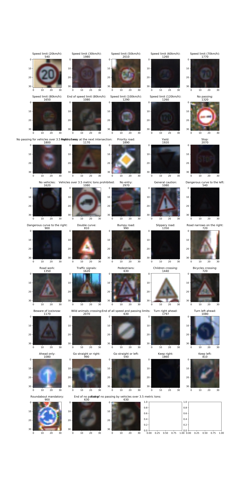
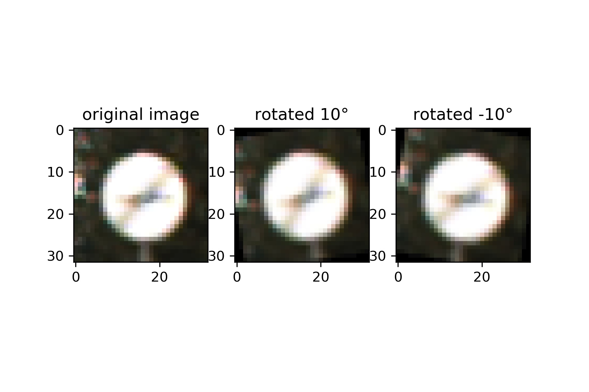
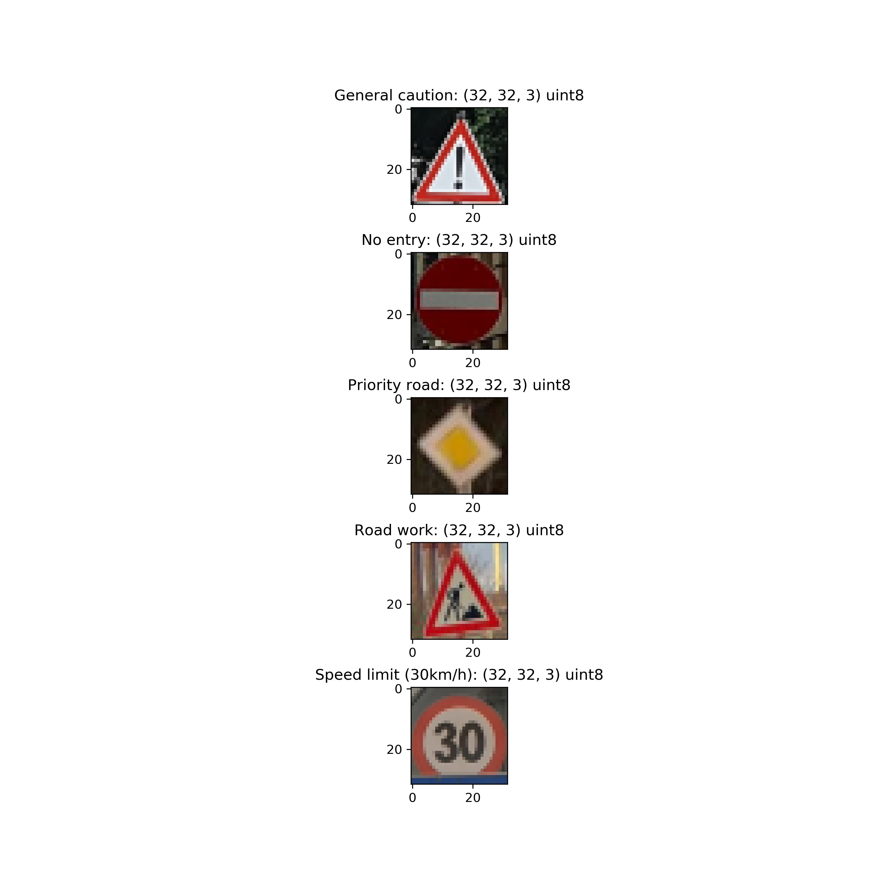

## Traffic Sign Recognition

This project belongs to my work towards Udacitys 'Self-Driving Car Engineer' Nanodegree. The general project goal is to write a software pipeline which adapts the popular LeNet architecture to train a traffic sign classifier.

The Project
---

The goals / steps of this project are the following:
* Load the data set (see below for links to the project data set)
* Explore, summarize and visualize the data set
* Design, train and test a model architecture
* Use the model to make predictions on new images and analyze the softmax probabilities of the new images
* Summarize the results with a written report (this one)

The entire project is developed in a signle jupyter notebook called `Traffic_Sign_Classifier.ipynb`. The individual tasks are documented below.

### Step 0: Load The Data
The data set ist stored within 3 pickle files in the `/data` folder of the project. The three files `train.p`, `valid.p` and `test.p` according to their intended use in the project.

### Step 1: Dataset Summary & Exploration
This step is intended to get a first overview on the dataset used to train and evaluate the classifier. To do so, the size of the dataset, the shape of the images and the number of classes are determined and printed:

Number of training examples = 34799
Number of testing examples = 12630
Image data shape = (32, 32)
Number of classes = 43

Afterwards, for each class the first image is visualized along with its class name and the amount of samples of that class as title. The visualization can be found in Fig. 1.1.

<figure>
 
 <figcaption>
 

 
 
 Fig. 1.1: Dataset Visualization
 
 </figcaption>
</figure>
 

 
 
### Step 2: Design and Test a Model Architecture
 
For the design of the traffic sogn classifier the LeNet5 architecture presented in the Udacity lecture was used as basis. LeNet5 is a well known architecture in the image classification domain and tehrefore a reliable starting point. For the implementation the images were normalized first using openCVs `normalize` function. This step is necessary as neural nets in general encounter problems when the range of different input channels has different magnitudes. Afterwards the models structured is defined as follows:

* convolutional layer (input)
    * Input = 32x32x**3**
    * Output = 28x28x6
    * Padding: Valid
    * Stride: 1x1
* max pooling layer
    * Input = 28x28x6
    * Output = 14x14x6
    * Stride: 2x2
* convolutional layer
    * Input = 14x14x6
    * Output = 10x10x16
    * Padding: Valid
    * Stride: 1x1
* max pooling layer
    * Input = 10x10x16
    * Output = 5x5x16
    * Padding: Valid
    * Stride: 2x2
* flattening
    * Input = 5x5x16
    * Output = 400
* fully connected layer 
    * Input = 400
    * Output = 120
* fully connected layer 
    * Input = 120
    * Output = 84
* fully connected layer (output)
    * Input = 84
    * Output = **43**
 
The only differences to the original LeNet5 architecture are therefore the size of the input channels, as our models accepts color images instead of grayscale images and the number of the output classes. The changed parameter are highlichted as bold text above. To increase the classification performance further the two hidden fully connected layers were trained using dropout. During training the following hyperparameters showed good results:

* EPOCHS = 27
* BATCH_SIZE = 128
* dropout = 0.62
* learning rate = 0.0006
* optimizer: AdamOptimizer
 
With these parameters and the original data set an accuracy of around 93% could be achieved. As this is only the lower bound for passing the project it was decided to perform further investigations. To do so, the confusion matrix shown in Fig. 2.1 proved to be very helpful. 

<figure>
 
 <figcaption>
 

 
 
 Fig. 2.1: Confusion Matrix
 
 </figcaption>
</figure>
 

 
The matrix shows, that most of the classifiers problems arise for classes which are underrepresneted in the training data set. Therefore, it was decided to augment the training data set through adding slightly rotated versions of samples belonging to rare classes. Another training and evaluation run with the same hyperparameters showed clearly increased performances with an accuracy of around 95% (During the last run were the html was produced 94.2%). An example for the rotation can be found in Fig 2.2.
 
<figure>
 
 <figcaption>
 

 
 
 Fig. 2.2: Rotation Example
 
 </figcaption>
</figure>
 

Afterwards the performance on the test dat set was as well calculated showing an accuracy of 92.9%.

### Step 3: Test the Model on New Images

To test the models performance on different images, 5 personal (in order to be able to upload the whole project to Github and nevertheless meet copyrights) images were used. The images are loaded and preprocessed so that they meet the shape of the originla training samples (32x32x3, uint8). A visualization of the images can be found in Fig. 3.1.

<figure>
 
 <figcaption>
 

 
 
 Fig. 3.1: Other test images
 
 </figcaption>
</figure>
 

A very interesting example is thereby the last one, as the lower part of the speed limit sign is hidden by another sign. 

The model classified the showed images as follows:

Actual Label: 18: General caution
  Label            Class Name Probability
0    18       General caution           1
1    27           Pedestrians           0
2    26       Traffic signals           0
3     0  Speed limit (20km/h)           0
4     1  Speed limit (30km/h)           0

Actual Label: 17: No entry
  Label            Class Name Probability
0    17              No entry           1
1     0  Speed limit (20km/h)           0
2     1  Speed limit (30km/h)           0
3     2  Speed limit (50km/h)           0
4     3  Speed limit (60km/h)           0

Actual Label: 12: Priority road
  Label            Class Name Probability
0    12         Priority road           1
1     0  Speed limit (20km/h)           0
2     1  Speed limit (30km/h)           0
3     2  Speed limit (50km/h)           0
4     3  Speed limit (60km/h)           0

Actual Label: 25: Road work
  Label                    Class Name Probability
0    25                     Road work           1
1    29             Bicycles crossing           0
2    20  Dangerous curve to the right           0
3    30            Beware of ice/snow           0
4    31         Wild animals crossing           0

Actual Label: 1: Speed limit (30km/h)
  Label                                         Class Name Probability
0     6                        End of speed limit (80km/h)     0.91483
1     5                               Speed limit (80km/h)      0.0338
2    42  End of no passing by vehicles over 3.5 metric ...     0.01536
3     1                               Speed limit (30km/h)     0.01073
4    40                               Roundabout mandatory     0.00947

This means, that only the sample which was already beforehand identified as very dificult is misclassified. In addition, it is noteworthy, that probability (rounded to 5 digits) for all of the over samples is 1 - meaning that the classifier is very sure about its decission. The accuracy on this small sample set is therefore 80%. Event though is that value lower than the evaluation showed on the test data set, but as the size of this data set is only 5 images, it can not be denoted as representative.
